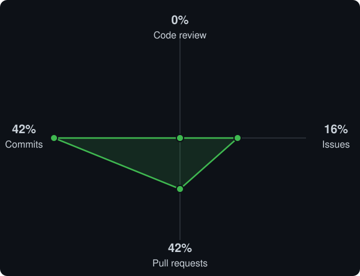

# Hi, I'm Tushar Anand 👋

**Software Engineer** — Backend & Distributed Systems (Java) · AI/Robotics Tooling (Python)

*Designing for scale, consistency, and fault tolerance.*

  
  
  

---

## About Me

I'm a software engineer focused on **backend and distributed systems** — the kind of problems where correctness under failure matters as much as raw throughput. My work spans decentralized architectures, load distribution, and consistency/fault-tolerance trade-offs in Java, alongside AI & robotics evaluation tooling in Python.

- 🏗️ Designing distributed systems around **decentralization, load balancing, and fault tolerance**
- ⚖️ Thinking in trade-offs: consistency vs. availability, latency vs. throughput, coupling vs. resilience
- 🤖 Building open-source **evaluation harnesses for VLA / physical-AI models** — define a benchmark once, run it against any policy, on any robot or simulator
- 🐍 Applied LLM tooling — RAG pipelines from embedding through retrieval and generation
- 📈 219+ contributions in the last year, active across 53 repositories

---

## System Design Focus

  
  
  
  
  
  

---

## GitHub Stats

  
  

  

---

## Tech Stack

**Languages**

**Systems & Backend**

**AI / ML**

---

## Featured Projects

### Decentralized_UPI
**Tech:** Java

A decentralized architecture for UPI-style payment processing, exploring how transaction integrity holds up without a single point of control.

- Designed the system around distributed consensus rather than a central authority, so no single node failure can corrupt transaction state
- Modeled fault-tolerance and recovery paths for nodes rejoining after a network partition
- Worked through the consistency trade-offs inherent to decentralizing a payments flow (ordering, double-spend prevention, idempotency)

### Dispatch_Load_Balancer
**Tech:** Java

A load balancer built to reason about traffic distribution as a system design problem, not just a routing rule.

- Implemented request dispatch across distributed nodes with pluggable load-distribution strategies
- Designed for graceful degradation — the system continues routing correctly as individual nodes become unhealthy
- Focused on minimizing tail latency under uneven load, not just average throughput

### Build_Your_Rag
**Tech:** Python

- Implemented a Retrieval-Augmented Generation (RAG) pipeline from scratch — embedding, retrieval, and generation stages
- Structured for swappable retrieval backends, so the pipeline isn't locked to one vector store or embedding model

### inspect-robots *(fork of [robocurve/inspect-robots](https://github.com/robocurve/inspect-robots))*
**Tech:** Python

- Contributing to an open-source evaluation harness for VLA / physical-AI models
- Define a benchmark once, run it against any policy, on any robot or simulator — decoupling evaluation logic from the underlying robot/sim implementation

<b>Activity in inspect-robots</b> — 8 merged PRs · 3 issues filed · 8 commits

  

**Shipped**

- `feat(cli)`: added `eval-set` to run multiple evaluation tasks in a single invocation
- `fix(cli)`: guarded `--max-action-delta` against invalid explicit values instead of silently weakening guardrails
- `fix(approver)`: corrected delta pose mode handling for clampable vs. non-clampable rotation deltas
- `fix(rollout)`: formalized the self-paced-only control-rate contract
- Froze `EvalLog` and related schemas — sequence fields converted to tuples for immutability
- Added CI coverage for the `rerun` extra, plus format checks and plugin-job coverage
- Covered `_ensure_env`'s config-wiring contract for Isaac Sim without requiring Isaac installed

**Found & filed**

- `[bug]` an explicit invalid `--max-action-delta` silently weakened guardrails instead of erroring — fixed
- `[bug]` `--epochs 0` (or negative) crashed with a raw traceback instead of a guided error — fixed
- `[feature]` proposal: `eval-set` should honor `--retry-attempts` by resuming partial runs — open

---

📫 Reach me on [LinkedIn](https://linkedin.com/in/tushar-anand-470558230)

